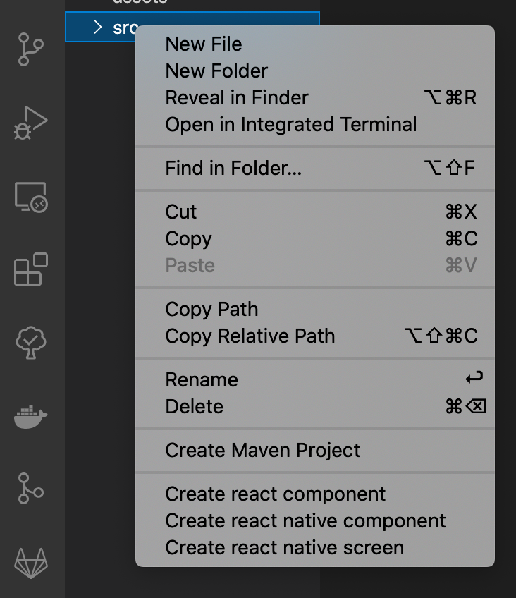

# React Quick Workflow

## Supported styles

Now only styled components supported for react and default styling for react native

## Configuration

You can configure projet type

Just add this line to your settings.json or configure this in vscode settings

```JSON
{
    "reactquickworkflow.projectType": "react" // or react-native
}
```

## Features

You can create react component, react native component and react native screen, just simple right click on the folder.
Also you can generate reducer or saga.



## How it works

> Example 1


